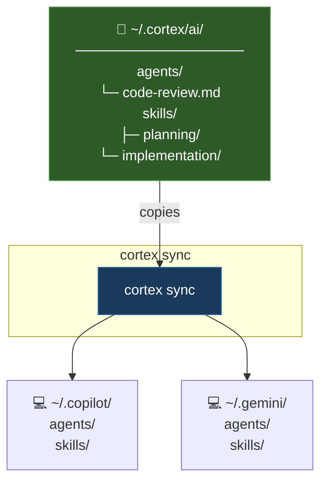

# Cortex

[](https://www.npmjs.com/package/@ignaciocastro0713/cortex)
[](https://www.npmjs.com/package/@ignaciocastro0713/cortex)
[](https://nodejs.org)
[](LICENSE)

> **Write your AI knowledge once. Distribute it everywhere.**

AI coding assistants like GitHub Copilot and Gemini read instructions from platform-specific directories (`~/.copilot/` for Copilot, `~/.gemini/` for Gemini). If you use multiple assistants, you end up duplicating the same agent definitions and skill prompts in each — keeping them in sync is tedious and error-prone.

Cortex solves this by storing your knowledge in one central place (`~/.cortex/ai/`) and copying it to each platform's global directory. Edit the source once — run `cortex sync` to propagate the changes everywhere.

## Install

```sh
npm install -g @ignaciocastro0713/cortex
```

> **Requirements:** Node.js >= 22 · Git (for `cortex update`)

## Quick start

### 1. Initialize (run once)

```sh
cortex init
```

Creates the following structure in your home directory:

```
~/.cortex/
  cortex.toml       ← configuration file
  ai/
    agents/         ← AI agent definitions (.md files)
    skills/         ← skill and instruction prompts (.md files)
  deps/             ← third-party knowledge cloned from Git
```

### 2. Add your knowledge files

Create `.md` files in `~/.cortex/ai/agents/` and `~/.cortex/ai/skills/`. These are plain Markdown files that your AI assistant will read as instructions.

**Example — `~/.cortex/ai/agents/code-review.md`:**
```markdown
# Code Review Agent
Review code for correctness, edge cases, and style issues.
Always suggest tests for uncovered paths.
```

**Example — `~/.cortex/ai/skills/testing.md`:**
```markdown
# Testing Skill
Write unit tests using the AAA pattern (Arrange, Act, Assert).
Prefer pure functions and avoid mocking unless necessary.
```

### 3. Configuration

`~/.cortex/cortex.toml` controls everything:

```toml
platforms = ["copilot", "gemini"]

[deps]
# Clone a third-party knowledge repo as a dependency
design-doc-mermaid = "https://github.com/SpillwaveSolutions/design-doc-mermaid"

[skills]
paths = [
  "~/.cortex/ai/skills/*",   # your own skills
  "@design-doc-mermaid",     # all files from the dep above
]

[agents]
paths = ["~/.cortex/ai/agents/*"]

[mcp]
# MCP servers synced globally to ~/.copilot/mcp-config.json and ~/.gemini/settings.json
[mcp.playwright]
command = "npx"
args = ["@playwright/mcp@latest"]

[mcp.context7]
command = "npx"
args = ["-y", "@upstash/context7-mcp"]
```

### 4. Sync

```sh
cortex sync
```

Cortex copies your files to `~/.copilot/` (Copilot) and `~/.gemini/` (Gemini). Run this once after editing your knowledge sources — the files are available globally in every project. Only files managed by Cortex are overwritten — files you created manually are left untouched. If Cortex previously synced a file and you've edited it locally, that file is skipped with a `⚠` warning in the tree; use `--force` to overwrite it.

Files removed from your config are automatically detected and deleted on the next sync. Empty directories are cleaned up automatically; directories containing files not managed by Cortex are preserved.

MCP server configs defined in `[mcp]` are synced to each platform's config file using a **merge strategy** — your manually-defined servers are preserved, and Cortex-managed servers are added or updated.

## How it works



## Commands

| Command | Description |
|---------|-------------|
| `cortex init` | Create `~/.cortex/cortex.toml` and the `~/.cortex/ai/` folder structure |
| `cortex sync` | Copy knowledge files to global platform directories and sync MCP configs |
| `cortex list` | Show the map of knowledge sources configured in `cortex.toml` |
| `cortex clean` | Remove all cortex-managed files from platform directories |
| `cortex update` | Pull latest changes for `~/.cortex/ai/` and all deps |

### Options

| Flag | Short | Description |
|------|-------|-------------|
| `--dry-run` | `-d` | Preview `sync` without making any changes |
| `--force` | `-f` | Overwrite locally modified files during `sync` |
| `--version` | `-v` | Print the current version and exit |
| `--help` | `-h` | Show the help message |

## Configuration reference

### Path prefixes

| Prefix | Resolves to |
|--------|-------------|
| `~` | User home directory |
| `@alias` | `~/.cortex/deps/{alias}` (a cloned dependency) |

### Platforms

| Platform | Files copied to | MCP config path |
|----------|---------------------|---------------------|
| `copilot` | `~/.copilot/` | `~/.copilot/mcp-config.json` |
| `gemini` | `~/.gemini/` | `~/.gemini/settings.json` |

## Project structure

```
src/
  index.ts          Entry point and argument parsing
  core/
    constants.ts    Shared paths and platform definitions
    hash-db.ts      MD5 hash tracking for dirty-file detection
    mcp.ts          MCP server config merge into platform JSON files
    parser.ts       TOML config reader/writer
    resolver.ts     Config resolution and entry deduplication
  utils/
    fs-utils.ts     Filesystem operations (copy, glob, path expansion)
    git-utils.ts    Git wrapper (clone, pull)
    log.ts          Colored terminal output via node:util styleText
    tree.ts         ASCII tree renderer
  commands/
    init.ts
    update.ts
    sync.ts
    list.ts
    clean.ts
test/
  commands/
    init.test.ts
    sync.test.ts
    list.test.ts
    clean.test.ts
    update.test.ts
  fs-utils.test.ts
  fs-utils-io.test.ts
  mcp.test.ts
  resolver.test.ts
  parser.test.ts
  sync-filters.test.ts
  git-utils.test.ts
```

## License

MIT — see [LICENSE](LICENSE) for details.