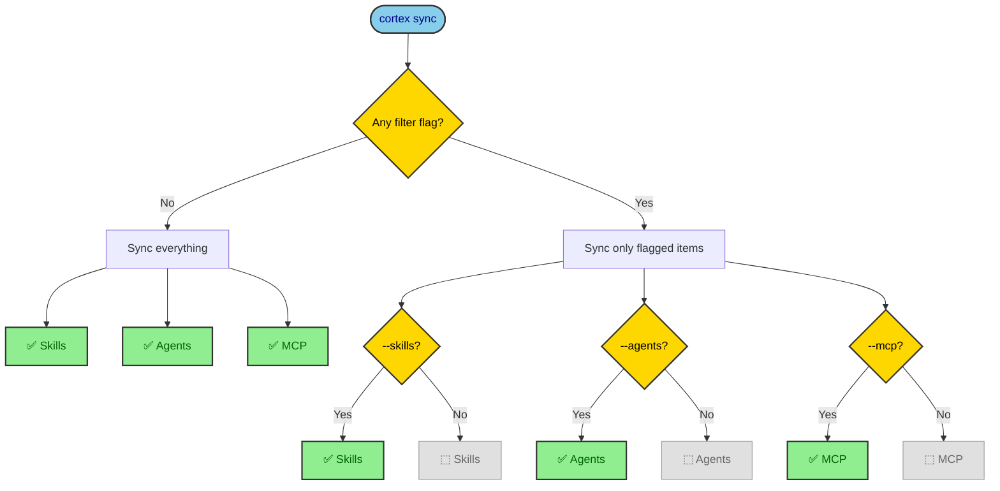
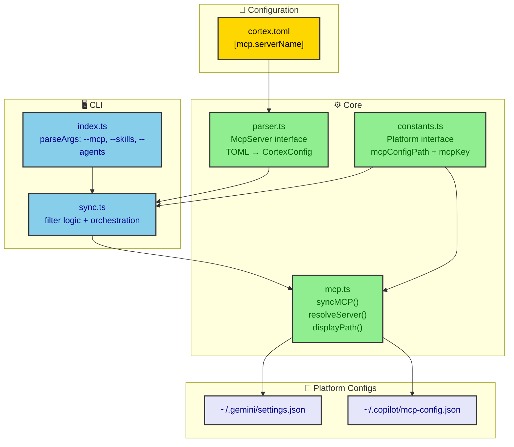
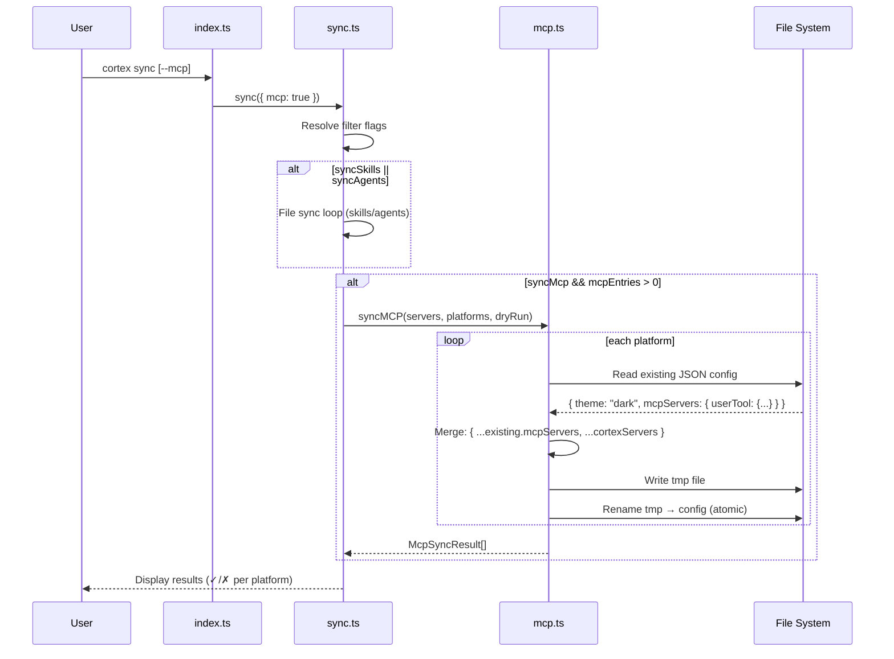
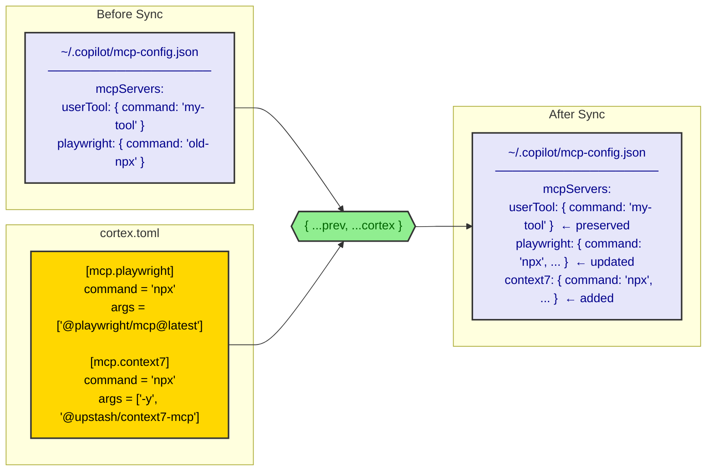

# MCP Sync — Feature Design Document

**Author:** Ignacio Castro  
**Date:** 2026-04-17  
**Status:** Implemented  
**Version:** 1.0

---

## 1. Feature Overview

### 1.1 Summary

**What:** Sync MCP (Model Context Protocol) server definitions from `cortex.toml` into each platform's global config file, using a merge strategy that preserves user-defined servers.

**Why:** MCP servers are global tools available to AI assistants regardless of project. Without Cortex managing them, users must manually edit JSON config files for each platform every time they add or update a server.

**Who:** Developers using GitHub Copilot CLI and/or Gemini CLI with MCP-compatible tools.

---

## 2. Background & Context

### 2.1 Problem Statement

AI coding assistants (Copilot CLI, Gemini CLI) support MCP servers configured via JSON files in the user's home directory. Each platform has its own config file (see [Platform Definitions](design-doc.md#platform-definitions) for the full table).

**Pain points:**
- Adding a new MCP server means editing 2+ JSON files manually
- No single source of truth — configs drift between platforms
- JSON editing is error-prone (trailing commas, missing brackets)
- No way to share MCP configs across machines via the existing `cortex.toml`

### 2.2 Goals

| Goal | Metric |
|------|--------|
| Single source of truth for MCP servers | All MCP defs live in `cortex.toml` only |
| Non-destructive sync | User-defined servers in platform configs are preserved |
| Composable with existing sync | MCP sync runs as part of `cortex sync` or standalone via `--mcp` flag |
| Atomic writes | No partial config files on crash |

---

## 3. User Experience

### 3.1 Configuration

Users define MCP servers in `cortex.toml`:

```toml
[mcp.playwright]
command = "npx"
args = ["@playwright/mcp@latest"]

[mcp.context7]
command = "npx"
args = ["-y", "@upstash/context7-mcp"]
env = { CONTEXT7_API_KEY = "$CONTEXT7_API_KEY" }

[mcp.custom-tool]
command = "node"
args = ["./my-tool/server.js"]
cwd = "~/projects/my-tool"
```

### 3.2 CLI Usage

```sh
cortex sync              # sync everything: skills + agents + MCP
cortex sync --mcp        # sync only MCP servers
cortex sync --dry-run    # preview all changes
cortex sync --mcp -d     # preview MCP changes only
```

### 3.3 Output

```
●  mcp
  ✓  playwright, context7  ~/.copilot/mcp-config.json
  ✓  playwright, context7  ~/.gemini/settings.json
```

On error:
```
●  mcp
  ✗  copilot  ~/.copilot/mcp-config.json — EACCES: permission denied
  ✓  playwright, context7  ~/.gemini/settings.json
```

### 3.4 Filter Flags



**Rule:** if no filter flags → sync everything. If any flag is present → only flagged categories.

| Flags | Skills | Agents | MCP |
|-------|--------|--------|-----|
| *(none)* | ✅ | ✅ | ✅ |
| `--skills` | ✅ | | |
| `--agents` | | ✅ | |
| `--mcp` | | | ✅ |
| `--skills --agents` | ✅ | ✅ | |
| `--skills --mcp` | ✅ | | ✅ |
| `--agents --mcp` | | ✅ | ✅ |

---

## 4. Technical Design

### 4.1 Architecture



### 4.2 Data Model

#### McpServer Interface

```typescript
interface McpServer {
  command: string;
  args?: string[];
  env?: Record<string, string>;
  cwd?: string;
}
```

#### Platform Interface (extended)

```typescript
interface Platform {
  name: string;
  targetDir: string;      // global dir (e.g., "~/.copilot")
  mcpConfigFile: string;  // JSON filename (e.g., "mcp-config.json")
  mcpKey: string;         // key name in the JSON file
}
```

The full MCP config path is derived as `path.join(targetDir, mcpConfigFile)`.

#### SyncOptions Interface (extended)

```typescript
interface SyncOptions {
  dryRun?: boolean;
  force?: boolean;
  skills?: boolean;   // NEW — filter flag
  agents?: boolean;   // NEW — filter flag
  mcp?: boolean;      // NEW — filter flag
}
```

#### McpSyncResult Interface

```typescript
interface McpSyncResult {
  platform: string;
  configPath: string;
  ok: boolean;
  error?: string;
}
```

### 4.3 Sync Flow



### 4.4 Merge Strategy



**Merge rules:**
- User-defined servers not in `cortex.toml` → **preserved**
- Servers in `cortex.toml` not in existing config → **added**
- Servers in both → **Cortex wins** (updated to match TOML)
- All other keys in the JSON file (e.g., `theme`) → **preserved**

### 4.5 Path Resolution in `cwd` Field

The `cwd` field in an MCP server definition supports the same path prefixes as skills/agents:

| Input | Resolved to |
|-------|-------------|
| `~/projects/tool` | `/home/user/projects/tool` |
| `@dep-name` | `~/.cortex/deps/dep-name/` |

This is handled by `resolveServer()` which delegates to the existing `expandPath()` utility.

---

## 5. Files Modified

### 5.1 New Files

| File | Purpose |
|------|---------|
| `src/core/mcp.ts` | `syncMCP()`, `resolveServer()`, `displayPath()`, `McpSyncResult` interface |
| `test/mcp.test.ts` | 8 tests: write, preserve keys, merge, mkdir, dry-run, error, displayPath x2 |
| `test/sync-filters.test.ts` | 9 tests: all filter flag combinations |

### 5.2 Modified Files

| File | Changes |
|------|---------|
| `src/core/parser.ts` | Added `McpServer` interface, `mcp` field to `CortexConfig`, default `mcp: {}` |
| `src/core/constants.ts` | Added `mcpConfigFile` and `mcpKey` to `Platform` interface and `PLATFORMS` array |
| `src/commands/sync.ts` | Added `skills`, `agents`, `mcp` to `SyncOptions`. Filter resolution logic. Platform loop restructured. MCP sync section. |
| `src/index.ts` | Added `--skills`, `--agents`, `--mcp` to `parseArgs`. Updated HELP text. Passes flags to `sync()`. |
| `README.md` | Added MCP config example, filter flags, platform MCP paths, updated project structure |

---

## 6. Key Implementation Details

### 6.1 syncMCP() — `src/core/mcp.ts`

```
Input:  Record<string, McpServer>, Platform[], dryRun: boolean
Output: McpSyncResult[]
```

For each platform:
1. Read existing JSON from `path.join(platform.targetDir, platform.mcpConfigFile)` (empty `{}` if missing/invalid)
2. Get existing servers: `prev = existing[platform.mcpKey] ?? {}`
3. Merge: `existing[platform.mcpKey] = { ...prev, ...resolved }`
4. Atomic write: `writeFile(tmp)` → `rename(tmp, config)`
5. Return `{ platform, configPath, ok, error? }`

### 6.2 Filter Resolution — `src/commands/sync.ts`

```typescript
const hasFilter = !!(options.skills || options.agents || options.mcp);
const syncSkills = !hasFilter || !!options.skills;
const syncAgents = !hasFilter || !!options.agents;
const syncMcp    = !hasFilter || !!options.mcp;
```

Three lines. If `hasFilter` is false (no flags), all three are `true`. If any flag is set, only those flags become `true`.

### 6.3 Platform Resolution Separation

Previously, `activePlatforms` was populated inside the file sync loop. This was restructured to resolve platforms first, then conditionally run file sync and MCP sync. This prevents empty platform headers when running `--mcp` only.

```
Before: for platform → push(platform) → sync files → end
After:  resolve platforms → if (files) { for platform → sync files } → if (mcp) { syncMCP }
```

---

## 7. Test Coverage

### 7.1 MCP Tests (`test/mcp.test.ts`) — 8 tests

| Test | Validates |
|------|-----------|
| writes mcpServers to each platform config | Basic write to both copilot and gemini configs |
| preserves existing keys in the config file | `theme: "dark"` survives alongside mcpServers |
| merges without removing user-defined servers | User's `userDefined` server preserved after merge |
| creates parent directory if missing | `mkdir -p` behavior for nested paths |
| dry-run returns ok without writing | File doesn't exist after dry-run |
| returns error result when write fails | Graceful error when path is blocked |
| displayPath replaces home with ~ | `C:\Users\x\.copilot\...` → `~/.copilot/...` |
| displayPath leaves non-home paths unchanged | `/tmp/file.json` stays as-is |

### 7.2 Filter Tests (`test/sync-filters.test.ts`) — 9 tests

| Test | Validates |
|------|-----------|
| no flags → sync everything | Default behavior unchanged |
| --skills → only skills | skills=true, agents=false, mcp=false |
| --agents → only agents | skills=false, agents=true, mcp=false |
| --mcp → only MCP | skills=false, agents=false, mcp=true |
| --skills --agents | skills+agents, no mcp |
| --skills --mcp | skills+mcp, no agents |
| --agents --mcp | agents+mcp, no skills |
| all three flags | Same as no flags (everything) |
| explicit false values | Same as no flags (everything) |

---

## 8. Design Decisions

### Why merge instead of replace?

The initial implementation replaced the entire `mcpServers` key. This was changed to merge because:

1. Users may define MCP servers outside of Cortex (e.g., project-specific tools)
2. Replacing would silently delete those servers on every sync
3. Merge is non-destructive: Cortex adds/updates its own, leaves the rest alone
4. Name collisions resolve in favor of Cortex (the TOML is the source of truth for managed servers)

Trade-off: Cortex cannot remove a server from platform configs just by deleting it from `cortex.toml`. A manual cleanup may be needed for decommissioned servers.

### Why global, not per-project?

See [Why global sync instead of per-project?](design-doc.md#why-global-sync-instead-of-per-project) in the main design doc. MCP servers are tools available to the AI assistant regardless of project context.

### Why `mcpKey` per platform?

Both platforms currently use `mcpServers`, but this is a coincidence. Storing the key name per platform means a new platform with a different key requires zero code changes — just a new entry in `PLATFORMS`.

### Why no `--no-mcp` / `--no-skills` / `--no-agents`?

The composable positive-flag approach (`--mcp`, `--skills`, `--agents`) covers all practical use cases with simpler logic. Adding exclusion flags would introduce ambiguity (what does `--skills --no-skills` mean?) for minimal benefit.

### Why resolve platforms before file sync?

Running `cortex sync --mcp` should not print platform headers with empty file sync output. Separating platform resolution from the file sync loop keeps the output clean — platform headers only appear when there are files to sync.

---

## 9. Future Considerations

- **`cortex mcp` subcommand** — Add/remove MCP servers via CLI without editing TOML
- **MCP server removal tracking** — Hash-based tracking for MCP entries to detect and remove decommissioned servers
- **Per-platform MCP transforms** — If a future platform uses a different MCP config structure, `mcpTransform` callbacks can be added per platform
- **MCP server validation** — Verify that `command` resolves to an executable before writing
