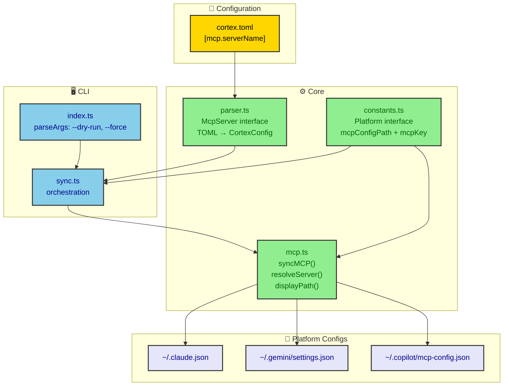
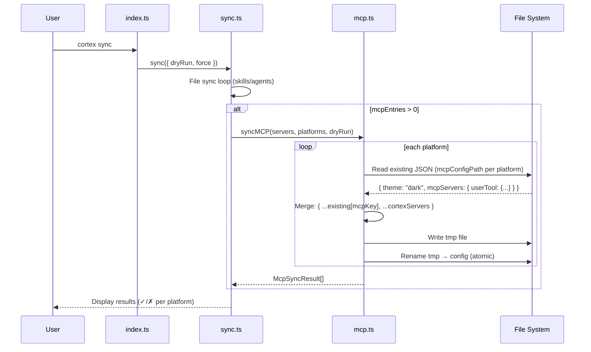
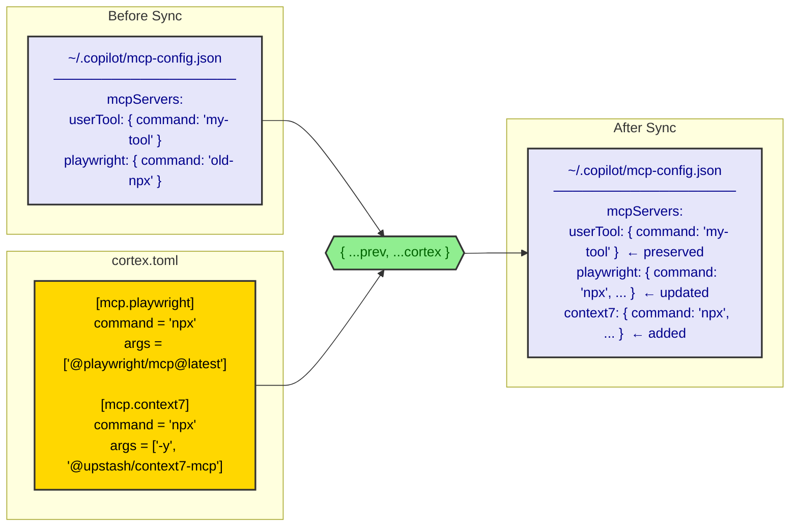

# MCP Sync — Feature Design Document

**Author:** Ignacio Castro  
**Date:** 2026-04-17  
**Status:** Implemented  
**Version:** 1.0

---

## 1. Feature Overview

### 1.1 Summary

**What:** Sync MCP (Model Context Protocol) server definitions from `cortex.toml` into each platform's global config file, using a merge strategy that preserves user-defined servers.

**Why:** MCP servers are global tools available to AI assistants regardless of project. Without Cortex managing them, users must manually edit JSON config files for each platform every time they add or update a server.

**Who:** Developers using GitHub Copilot CLI, Gemini CLI, and/or Claude CLI with MCP-compatible tools.

---

## 2. Background & Context

### 2.1 Problem Statement

AI coding assistants (Copilot CLI, Gemini CLI, Claude CLI) support MCP servers configured via JSON files in the user's home directory. Each platform has its own config file (see [Platform Definitions](design-doc.md#platform-definitions) for the full table).

**Pain points:**
- Adding a new MCP server means editing 2+ JSON files manually
- No single source of truth — configs drift between platforms
- JSON editing is error-prone (trailing commas, missing brackets)
- No way to share MCP configs across machines via the existing `cortex.toml`

### 2.2 Goals

| Goal | Metric |
|------|--------|
| Single source of truth for MCP servers | All MCP defs live in `cortex.toml` only |
| Non-destructive sync | User-defined servers in platform configs are preserved |
| MCP sync runs as part of `cortex sync` | No separate command needed |
| Atomic writes | No partial config files on crash |

---

## 3. User Experience

### 3.1 Configuration

Users define MCP servers in `cortex.toml`:

```toml
[mcp.playwright]
command = "npx"
args = ["@playwright/mcp@latest"]

[mcp.context7]
command = "npx"
args = ["-y", "@upstash/context7-mcp"]
env = { CONTEXT7_API_KEY = "$CONTEXT7_API_KEY" }

[mcp.custom-tool]
command = "node"
args = ["./my-tool/server.js"]
cwd = "~/projects/my-tool"
```

### 3.2 CLI Usage

```sh
cortex sync           # sync everything: skills + agents + MCP
cortex sync --dry-run # preview all changes
```

### 3.3 Output

```
●  mcp
  ✓  playwright, context7  ~/.copilot/mcp-config.json
  ✓  playwright, context7  ~/.gemini/settings.json
  ✓  playwright, context7  ~/.claude.json
```

On error:
```
●  mcp
  ✗  copilot  ~/.copilot/mcp-config.json — EACCES: permission denied
  ✓  playwright, context7  ~/.gemini/settings.json
  ✓  playwright, context7  ~/.claude.json
```

---

## 4. Technical Design

### 4.1 Architecture



### 4.2 Data Model

#### McpServer Interface

```typescript
interface McpServer {
  command: string;
  args?: string[];
  env?: Record<string, string>;
  cwd?: string;
}
```

#### Platform Interface

```typescript
interface Platform {
  name: string;
  targetDir: string;       // global dir (e.g., "~/.copilot")
  mcpConfigPath: string;   // absolute path to the JSON config file
  mcpKey: string;          // key name in the JSON file
}
```

#### SyncOptions Interface

```typescript
interface SyncOptions {
  dryRun?: boolean;
  force?: boolean;
}
```

#### McpSyncResult Interface

```typescript
interface McpSyncResult {
  platform: string;
  configPath: string;
  ok: boolean;
  error?: string;
}
```

### 4.3 Sync Flow



### 4.4 Merge Strategy



**Merge rules:**
- User-defined servers not in `cortex.toml` → **preserved**
- Servers in `cortex.toml` not in existing config → **added**
- Servers in both → **Cortex wins** (updated to match TOML)
- All other keys in the JSON file (e.g., `theme`) → **preserved**

### 4.5 Path Resolution in `cwd` Field

The `cwd` field in an MCP server definition supports the same path prefixes as skills/agents:

| Input | Resolved to |
|-------|-------------|
| `~/projects/tool` | `/home/user/projects/tool` |
| `@dep-name` | `~/.cortex/deps/dep-name/` |

This is handled by `resolveServer()` which delegates to the existing `expandPath()` utility.

---

## 5. Files Modified

### 5.1 New Files

| File | Purpose |
|------|---------|
| `src/core/mcp.ts` | `syncMCP()`, `resolveServer()`, `displayPath()`, `McpSyncResult` interface |
| `test/mcp.test.ts` | 8 tests: write, preserve keys, merge, mkdir, dry-run, error, displayPath x2 |

### 5.2 Modified Files

| File | Changes |
|------|--------|
| `src/core/parser.ts` | Added `McpServer` interface, `mcp` field to `CortexConfig`, default `mcp: {}` |
| `src/core/constants.ts` | Added `mcpConfigPath` and `mcpKey` to `Platform` interface and `PLATFORMS` array |
| `src/commands/sync.ts` | MCP sync section after file sync loop |
| `README.md` | Added MCP config example, platform MCP paths, updated project structure |

---

## 6. Key Implementation Details

### 6.1 syncMCP() — `src/core/mcp.ts`

```
Input:  Record<string, McpServer>, Platform[], dryRun: boolean
Output: McpSyncResult[]
```

For each platform:
1. Read existing JSON from `platform.mcpConfigPath` (empty `{}` if missing/invalid)
2. Get existing servers: `prev = existing[platform.mcpKey] ?? {}`
3. Merge: `existing[platform.mcpKey] = { ...prev, ...resolved }`
4. Atomic write: `writeFile(tmp)` → `rename(tmp, config)`
5. Return `{ platform, configPath, ok, error? }`

### 6.2 Platform Resolution Separation

Platforms are resolved first, then file sync and MCP sync run unconditionally if there is content to sync. This keeps the output clean — platform headers only appear when there are files to sync.

---

## 7. Test Coverage

### MCP Tests (`test/mcp.test.ts`) — 8 tests

| Test | Validates |
|------|-----------|
| writes mcpServers to each platform config | Basic write to both copilot and gemini configs |
| preserves existing keys in the config file | `theme: "dark"` survives alongside mcpServers |
| merges without removing user-defined servers | User's `userDefined` server preserved after merge |
| creates parent directory if missing | `mkdir -p` behavior for nested paths |
| dry-run returns ok without writing | File doesn't exist after dry-run |
| returns error result when write fails | Graceful error when path is blocked |
| displayPath replaces home with ~ | `C:\Users\x\.copilot\...` → `~/.copilot/...` |
| displayPath leaves non-home paths unchanged | `/tmp/file.json` stays as-is |


---

## 8. Design Decisions

Architecture decisions related to MCP sync are documented as ADRs in [`docs/decisions/`](decisions/). Key decisions with their rationale:

| ADR | Decision | Why |
|-----|----------|-----|
| [003](decisions/003-mcp-merge-strategy.md) | Merge strategy instead of replace | Replacing the entire `mcpServers` key would destroy user-defined servers not tracked by Cortex. Merging is non-destructive: Cortex only owns what it wrote. |
| [004](decisions/004-mcpkey-per-platform.md) | `mcpKey` per platform | Each platform uses a different top-level key for MCP servers (`mcpServers` for Copilot/Claude, `mcpServers` for Gemini). Externalizing this per platform avoids hardcoding key names in `mcp.ts`. |
| [009](decisions/009-no-mcp-transformations.md) | No MCP transformations per platform | Platforms accept the same MCP server shape — no field renaming or restructuring needed. Keeping the TOML definition as-is avoids a translation layer that would add complexity with no current benefit. |

### Why `mcpConfigPath` is an absolute path

Claude's MCP config (`~/.claude.json`) lives **outside** its `targetDir` (`~/.claude/`). If the config path were stored as a filename + `targetDir`, Claude would be impossible to represent correctly. By making `mcpConfigPath` an absolute path on the `Platform` interface, each platform can point to any location — no assumptions about directory layout.

### Why Claude was added as a platform

Claude CLI (Anthropic) supports the same MCP protocol and uses a nearly identical config structure (`mcpServers` key in a JSON file). The only differences are the config file location and directory. Since the platform model already abstracts both, adding Claude required no changes to `mcp.ts` — only a new entry in `PLATFORMS`.

---

## 9. Future Considerations

- **`cortex mcp` subcommand** — Add/remove MCP servers via CLI without editing TOML
- **MCP server removal tracking** — Hash-based tracking for MCP entries to detect and remove decommissioned servers
- **Per-platform MCP transforms** — If a future platform uses a different MCP config structure, `mcpTransform` callbacks can be added per platform
- **MCP server validation** — Verify that `command` resolves to an executable before writing
